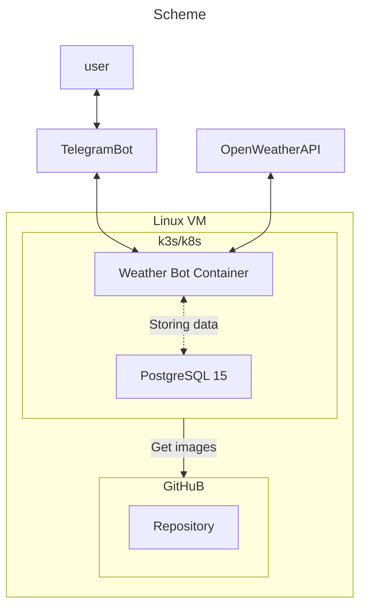
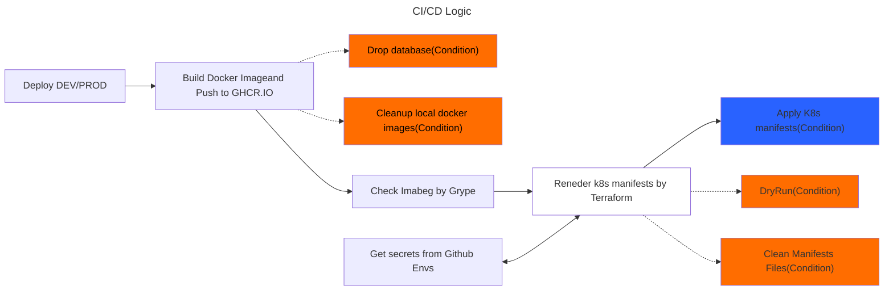

# Telegram Weather bot with CI/CD deploying pipline in k3s/k8s.

## Description:
This repo contains Python code of telegram bot and CI/CD code for deployig in dev/prod environments:

## Bot telegram id [PROD version]

https://t.me/weather_rms_bot

## About App:
It is a python based app Telegram bot

## Features:

- **Free weather API** - bot uses free Open Weather API

- **Weather autosend function** - bot sends  Weather at desired time, uses UTC time zone.

## Requrements:
  - Linux based OS
  - Terraform >= 1.9
  - k3s/k8s
  - Anchore Grype tool
  - Github runner
  - poetry
  - Python > 3.7
  - pip

## Backup DB
Backup is bening processed by schedule

## Main files:
1. **docker/**
    - Dockerfile - to build app
    - main.py - app core
    - entrypoint.sh - entrypoint for container
    - requiremenets.txt - python packages for app
2. **.github/** - CI/CD workflow
3. **deployment/terraform**
    - templates/*.tpl - manifests templates
    - main.tf - terraform main file
4. **.ci/** - config files for linters

## Quick start:
TBD

## Known bugs and limitations
1. Hourly weather may show the wrong hour, will be fixed in next releases.
2. It is small possibility that bot sends auto message twice, default check interval is 58 seconds.

## License
GNU GPL v3
